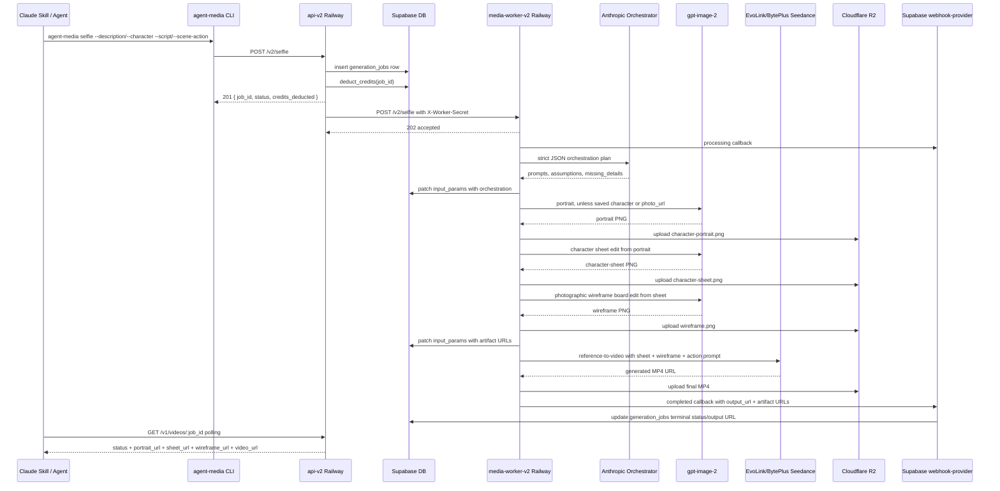

# Selfie Production Architecture

Last verified: 2026-05-24.

This document describes the production Selfie path as shipped in:

- product repo `yuvalsuede/agent-media`, `main` at `aba8d703ff927772f432e0a4584a16b2d6f3c623`
- public skill repo `gitroomhq/agent-media`, `main` at `939c29f65bc0d9884fd80c7ef9adf237149f0118`
- npm `agent-media-cli@1.15.1`
- npm `@agentmedia/schema@0.5.1`

The active Selfie implementation is the adapter path:

`/v2/selfie` -> `services/media-worker-v2/src/v2/server-routes.js` -> `services/media-worker-v2/src/v2/selfie-adapter.js`

`services/media-worker-v2/src/v2/selfie-pipeline.js` still exists, but it is not the active `/v2/selfie` dispatch target.

## End-To-End Flow



## Public Inputs

Source of truth: `packages/schema/src/v2/selfie.ts`.

Valid character paths:

- `character_id`: saved reusable character id matching `^char_[A-Za-z0-9]{10,}$`
- `description`: text-only character generation, 8-400 chars
- `description` + `photo_url`: exact-likeness reference

Invalid character combinations:

- no `character_id` and no `description`
- `character_id` together with `description` or `photo_url`
- `photo_url` without `description`

Valid action paths:

- `script`: spoken verbatim, max 600 chars
- `scene_action`: what the actor does, 4-400 chars
- at least one of `script` or `scene_action` is required

Other fields:

- `background_music`: boolean or 2-200 char string
- `duration`: exactly `5`, `10`, or `15`, default `10`
- `subtitles`: boolean, default `true`

Removed/unsupported current Selfie fields:

- `preset`
- `vibe`
- `voice_brief`
- `sync`

## CLI Surface

Source: `apps/cli/src/v2/commands/selfie.ts`.

Registered through:

- `apps/cli/src/index.ts` imports `registerV2Commands`
- `apps/cli/src/v2/commands/index.ts` calls `registerSelfieCommand`

Command:

```bash
agent-media selfie
```

Options:

- `--character <id>`: saved character id
- `--description <text>`: text-only actor description
- `--photo <file|url>`: optional likeness reference, requires `--description`
- `--script <text|@file>`: exact spoken line, supports file read with `@path`
- `--scene-action <text>`: behavior, product handling, turns, movement, no-speech action
- `--background-music [text]`: `true` if flag alone, string if text is supplied
- `--duration <seconds>`: parsed and rejected unless 5/10/15
- `--subtitles <bool>`: parser treats any value except string `false` as true
- `--profile <name>`: credential profile

CLI validation mirrors the schema before submission:

- requires `--character` or `--description`
- rejects `--character` combined with `--description` or `--photo`
- rejects `--photo` without `--description`
- requires `--script` or `--scene-action`

Local photos are uploaded through `apps/cli/src/v2/lib.ts`:

- accepts `http(s)` URLs unchanged
- accepts local `.png`, `.jpg`, `.jpeg`, `.webp`, `.heic`
- uses `AgentMediaAPI.getUploadUrl()`
- uploads file bytes to the presigned URL
- returns public Supabase generation-inputs URL:
  `https://ppwvarkmpffljlqxkjux.supabase.co/storage/v1/object/public/generation-inputs/<storage_path>`

Submission:

- builds body from valid provided fields
- posts to `def.rest.path`, currently `/v2/selfie`
- expects HTTP `201`
- prints the `job_id`
- polls with `pollV2()` until `completed`, `failed`, or `canceled`
- outputs `video_url` or `result_url`

`AgentMediaAPI` defaults to `https://api.agent-media.ai` and can be overridden with `AGENT_MEDIA_API_URL`.

## API V2

Source: `services/api-v2/src/server.ts`.

Runtime:

- Express on `PORT || 3001`
- Railway service `api-v2`
- Node >= 20
- Dockerfile builds `@agentmedia/schema`, then `api-v2`

Important middleware:

- `express.json()`
- auth middleware requires `Authorization: Bearer <token>`
- `verifyToken()` attaches `req.userId` and `req.authToken`
- generate limiter: 10 requests/minute per user or IP
- read limiter: 60 requests/minute per user or IP

Registered v2 routes:

- `POST /v2/selfie`
- `POST /v2/characters`
- `GET /v2/characters`
- `POST /v2/subtitle`
- `POST|GET|DELETE /mcp`

Selfie route source: `services/api-v2/src/routes/v2/selfie.ts`.

Route steps:

1. Require authenticated `userId`.
2. Validate request with `SelfieSchema`.
3. Determine `duration = input.duration ?? 10`.
4. Quote credits with `quoteV2Credits('selfie', { durationSeconds: duration })`.
5. Require `WORKER_V2_URL` and `WORKER_SECRET`.
6. Create `jobId = crypto.randomUUID()`.
7. Insert `generation_jobs`:
   - `id = jobId`
   - `user_id = userId`
   - `model_slug = seedance-2.0-selfie`
   - `operation = selfie`
   - `status = submitted`
   - `prompt = input.script ?? input.scene_action ?? '(no script - non-speech clip)'`
   - `credit_cost = quoted credits`
   - `provider_slug = railway`
   - `provider_job_id = jobId`
   - `input_params` includes character/script/action/music/duration/subtitles
8. Deduct credits through RPC:
   - `deduct_credits(p_user_id, p_amount, p_job_id, p_description='Selfie · <duration>s')`
9. On credit failure:
   - delete job row
   - return `402 INSUFFICIENT_CREDITS` or `500 CREDIT_DEDUCTION_FAILED`
10. Build callback URL:
    - `${SUPABASE_URL}/functions/v1/webhook-provider?provider=railway&job_id=${jobId}`
11. Fire-and-forget dispatch:
    - `POST ${WORKER_V2_URL}/v2/selfie`
    - headers: `Content-Type: application/json`, `X-Worker-Secret: WORKER_SECRET`
12. Return:
    - HTTP `201`
    - `{ job_id, status: 'submitted', credits_deducted, generator: 'selfie' }`

Important behavior:

- The API does not wait for worker acceptance before returning to the CLI.
- Worker dispatch failure is logged asynchronously.
- Refund-on-failure is handled by the webhook/failure path, not by this route.

## Worker V2 Route And Queue

Source: `services/media-worker-v2/src/server.js`.

Runtime:

- Express on `PORT || 3000`
- Railway service `media-worker-v2`
- Node >= 20
- Dockerfile installs `ffmpeg`, fonts, Python/OpenCV dependencies, then runs `node src/server.js`

Security:

- `verifySecret()` requires `X-Worker-Secret` matching `WORKER_SECRET`

Route registration:

- `server.js` imports `registerV2Routes` from `services/media-worker-v2/src/v2/server-routes.js`
- `registerV2Routes(app, verifySecret)` is called before legacy routes

V2 queue:

- `v2UserQueues = new Map()`
- queue key is `user_id || 'anonymous'`
- per user, only one v2 job runs at a time
- queued jobs are FIFO
- v2 queue is separate from legacy worker queue

`POST /v2/selfie` worker validation:

- requires `job_id`
- requires `script` or `scene_action`
- requires `character_id` or `description`
- rejects `character_id` combined with `photo_url` or `description`
- rejects `photo_url` without `description`

Worker accepted response:

- immediate `202 { accepted: true, job_id }`
- if queued: `202 { accepted: true, job_id, queued: true, position }`

Callbacks to Supabase:

- start: `{ job_id, status: 'processing', stage: 'started', message: 'v2 selfie job started' }`
- progress: `{ job_id, status: 'processing', stage, ...meta }`
- success:
  - `{ job_id, status: 'completed', output_url, portrait_url, sheet_url, wireframe_url, seed }`
- failure:
  - `{ job_id, status: 'failed', error, error_code: 'V2_PIPELINE_FAILED' }`

## Selfie Adapter: Active Pipeline

Source: `services/media-worker-v2/src/v2/selfie-adapter.js`.

Imports:

- Supabase client
- `generateCharacterSheet` from `../character-sheets.js`
- `generateImageEdit`, `generateImageFromText` from `../openai-image-client.js`
- `r2Upload` from `../r2.js`
- `processCharacterVideo` from `../character-video-pipeline.js`
- `orchestrateSelfie` from `./selfie-orchestrator.js`

R2 logical bucket prefix:

- `generation-outputs`

Hard entry validation:

- `job_id` required
- either `character_id` or `description` required
- either `script` or `scene_action` required

Pipeline steps:

1. Run internal Claude orchestration.
2. Build simple character-sheet prompt from the user description.
3. Build photographic wireframe prompt from orchestration/script/action/setting/wardrobe/props.
4. Patch `generation_jobs.input_params` with orchestration and prompts.
5. Resolve or generate portrait/sheet.
6. Generate wireframe board.
7. Patch artifact URLs into `generation_jobs.input_params`.
8. Build Seedance `action_prompt`.
9. Call `processCharacterVideo`.
10. Return video and intermediate URLs.

### Character Sheet Prompt Builder

Function: `buildCharacterSheetPrompt(description)`.

Exact fallback with no usable description:

```text
Create a full character sheet, including full body, and outfit for this person.
```

If there is a description, it extracts only:

- age: regex detects `30 year old`, `30yo`, `30 y/o`
- gender words: `male`, `man`, `guy`, `female`, `woman`, `girl`, `non-binary`, `nonbinary`
- context between age and gender after stripping generic words
- explicit body details from `BODY_DETAIL_RE`:
  - tall
  - petite
  - slim
  - lean
  - athletic
  - muscular
  - stocky
  - broad-shouldered / broad shouldered
  - plus-size / plus size
  - curvy
  - heavyset
  - overweight
  - underweight
  - average build
  - medium build

It deliberately does not restate hair, skin, beard, eyes, color, face details, etc.

Output format:

```text
Create a full character sheet, including full body, and outfit for this person - <brief>.
```

Example for `a 30yo israeli male`:

```text
Create a full character sheet, including full body, and outfit for this person - 30yo Israeli male.
```

### Wireframe Prompt Builder

Function: `buildWireframePrompt(...)`.

It builds a story string from:

- exact script: `the actor is saying: "<script>"`
- action: `while: <scene_action>`
- setting
- wardrobe/outfit
- up to 4 minimal props

The final prompt always asks GPT Image 2 to:

- create a full photographic wireframe/storyboard board for the user story
- use the orchestration-generated frame plan only for visual beats
- not add spoken dialogue beyond the exact script
- build 8-10 separate frames in a clean grid
- make every frame a realistic photographic still
- preserve same actor, face, body, and outfit from the character sheet
- include distinct beats such as hook, setup, context, demo/action, reaction, proof/result, emotional shift, closing reaction
- add captions/explanations for frame number, spoken beat/action, expression, gesture, framing
- avoid sketches, pencil art, line art, rough drawings
- use real-world UGC lighting and continuity
- avoid visible phone/camera/mirror/selfie arm unless explicitly requested
- state that the board is not the final video frame

### Portrait Generation

Function: `generatePortrait(...)`.

- progress stage: `portrait`
- OpenAI model call: `generateImageFromText`
- size: `1024x1024`
- quality: `medium`
- upload key: `generation-outputs/<user_id>/<job_id>/character-portrait.png`

Skipped when:

- `character_id` is supplied
- `photo_url` is supplied, in which case that URL is used as the portrait reference

### Saved Character Path

Function: `loadSavedCharacterSheet(publicId)`.

Reads `user_characters`:

- select `character_sheet_url, archived_at`
- match `public_id`
- fail if not found
- fail if archived
- fail if no `character_sheet_url`

Saved characters skip portrait and sheet generation. They still generate a new wireframe per video.

### New Character Path

If no `character_id`:

- use `photo_url` if provided
- otherwise generate a portrait from orchestration prompt
- generate a character sheet with `generateCharacterSheet`
- pass:
  - `description`
  - `referenceImageUrl = portrait_url`
  - `sheetPrompt = buildCharacterSheetPrompt(description)`
  - `jobId`
  - `userId`
  - progress callback

### Wireframe Generation

Function: `generateWireframe(...)`.

- downloads the character sheet URL
- calls `generateImageEdit`
- reference image: character sheet buffer
- size: `1024x1536`
- quality: `medium`
- upload key: `generation-outputs/<user_id>/<job_id>/wireframe.png`

### Action Prompt To Seedance

Function: `buildActionPrompt(...)`.

Includes:

- orchestration `seedance_prompt`
- resolved scene action
- resolved setting
- resolved wardrobe/look
- minimal props or `none unless already visible in the wireframe`
- vertical 9:16 TikTok selfie shot
- character faces camera directly, eyes to lens
- locked camera: no pan/zoom/tilt/dolly/tracking/shake
- no phone/camera/selfie arm in frame
- exact script in quotes if present: `They say: "<script>"`
- background music instruction if set
- if no script: no dialogue, no humming, no vocalization

Audio flags:

- `hasScript = finalScript.trim()`
- `hasMusic = background_music !== undefined && background_music !== false && background_music !== null`
- `generate_audio = hasScript || hasMusic`
- `shouldBurnSubtitles = orchestration.subtitles && hasScript`

Call to `processCharacterVideo`:

- `character_sheet_url`
- `storyboard_url = wireframe_url`
- `action_prompt`
- `duration`
- `aspect_ratio = 9:16`
- `generate_audio`
- `subtitle_style = hormozi` when subtitles and script, otherwise `none`

## Internal Orchestrator

Source: `services/media-worker-v2/src/v2/selfie-orchestrator.js`.

Model selection:

1. `SELFIE_ORCHESTRATOR_MODEL`
2. `PORTRAIT_PROMPTER_MODEL`
3. fallback `claude-opus-4-7`

Requires:

- `ANTHROPIC_API_KEY`

Anthropic request:

- endpoint: `https://api.anthropic.com/v1/messages`
- header `anthropic-version: 2023-06-01`
- `max_tokens: 5000`
- timeout: `75_000` ms

Required JSON shape:

```json
{
  "portrait_prompt": "string",
  "character_sheet_prompt": "string",
  "script": "string or null",
  "scene_action": "string",
  "setting": "string",
  "wardrobe": "string",
  "minimal_props": ["string"],
  "wireframe_prompt": "string",
  "seedance_prompt": "string",
  "duration": 5,
  "background_music": true,
  "subtitles": true,
  "missing_details": ["string"],
  "assumptions": ["string"]
}
```

Orchestrator hard rules:

- output only JSON
- preserve user script verbatim
- if details are missing, choose defaults for the worker and list assumptions
- also list what the external skill should have asked in `missing_details`
- use requested duration exactly
- keep props minimal
- never invent products
- never show phone/camera/mirror/selfie arm/outstretched arm unless explicit
- default camera locked off
- final video is 9:16 front-camera selfie, subject faces lens

Portrait rules:

- tight full-face/headshot only
- face, hair, top of shoulders at most
- no hands, props, phone, outfit detail beyond edge of clothing
- starts with `Tight hyper-realistic candid iPhone front-camera face portrait of`
- includes real camera optics, skin texture, pores, imperfections, asymmetry, lived-in light, hair physics, eye catchlights, warm phone footage

Wireframe rules:

- photographic planning board, not sketch
- 8-10 realistic photo stills in one grid
- exact spoken line when present
- what actor is doing while saying it
- captions can split exact script but cannot invent dialogue/claims/CTA
- preserve same actor in every frame
- short explanation/caption per frame

Seedance rules:

- character sheet is identity reference
- wireframe is staging/composition reference
- include exact script in quotes if present
- if no script, explicitly no dialogue/no vocalization
- repeat locked camera and no-phone rules

Normalization after Claude returns:

- strips JSON code fences if present
- parses object, with fallback to first `{...}` block
- script is always original user script if present, not Claude rewrite
- default scene action:
  - with script: `speaking directly to camera with natural facial expression and small relaxed gestures`
  - no script: `facing camera with natural movement`
- default setting: `lived-in bedroom with soft natural window light`
- default wardrobe: `casual everyday outfit`
- props capped to first 4 strings
- portrait prompt gets no-phone/no-camera/no-hands/no-selfie-arm/no-plastic/no-uncanny phrase appended
- wireframe prompt gets required photographic board phrase appended if missing
- seedance prompt gets locked-camera/no-phone phrase appended if missing
- duration normalized to 5/10/15, otherwise fallback 10
- background music:
  - explicit request wins
  - valid model true/false/null/string accepted
  - if no script defaults true
  - if script defaults null

## OpenAI Image Client

Source: `services/media-worker-v2/src/openai-image-client.js`.

Requires:

- `OPENAI_API_KEY`

Base URL:

- `https://api.openai.com/v1`

Text-to-image:

- function `generateImageFromText`
- endpoint `/images/generations`
- default model `gpt-image-2`
- default size `1024x1024`
- default quality `medium`
- default timeout `600_000` ms
- returns first `data[0].b64_json` as PNG buffer

Image edit:

- function `generateImageEdit`
- endpoint `/images/edits`
- default model `gpt-image-2`
- supports multiple `image[]` buffers
- detects MIME from magic bytes
- default size `1024x1024`
- allowed by comments: `1024x1024`, `1024x1536`, `1536x1024`, `auto`
- default quality `medium`
- default timeout `600_000` ms
- default attempts `3`
- retry delay `15_000` ms * attempt
- transient statuses: 408, 429, 5xx
- content policy rejection gets `err.code = CONTENT_POLICY`

## Character Sheet Helper

Source: `services/media-worker-v2/src/character-sheets.js`.

For Selfie, this helper is called with:

- `referenceImageUrl`
- `sheetPrompt`
- `jobId`
- `userId`

Important behavior:

- if `OPENAI_API_KEY` exists, uses OpenAI direct instead of EvoLink proxy
- shrinks reference image with Sharp:
  - auto rotate
  - max 1024x1024
  - JPEG quality 85
- direct OpenAI image edit:
  - size `1536x1024`
  - quality `medium`
  - `n = 1`
  - timeout `CHARACTER_SHEETS_IMAGE_TIMEOUT_MS || 600_000`
- uploads to R2 key:
  - `generation-outputs/<user_id>/<job_id>/character-sheet.png`

If no reference image is supplied, helper can generate a portrait first, but active Selfie adapter usually supplies either generated `portrait_url` or user `photo_url`.

## Seedance / Character Video

Source: `services/media-worker-v2/src/character-video-pipeline.js`.

Selfie uses the existing character-video pipeline to render the final MP4.

Provider selection:

- default `VIDEO_PROVIDER` path is EvoLink
- `VIDEO_PROVIDER=byteplus` uses BytePlus ModelArk

Required for EvoLink:

- `EVOLINK_API_KEY` or provider key pool

Required for BytePlus:

- `ARK_API_KEY`

Duration:

- clamped to min 5, max 15 inside `processCharacterVideo`

Prompt construction:

- `userScene = action_prompt` if supplied
- `imageUrls = [character_sheet_url]`
- if `storyboard_url` exists, append it as image 2
- if asset exists, append as later image

Role hints:

- image 1 = character likeness reference: face, body, outfit
- image 2 = photographic storyboard/wireframe board reference only
- the board contributes action beats, staging, expression, gestures, framing, blocking
- the final video must never render the board, panel grid, captions, labels, UI, or source-image layout

Final Seedance prompt includes:

- `Scene: <action_prompt>`
- image role hints
- real-world environment matching scene
- natural lighting
- depth of field
- ambient detail
- never show plain studio/parchment/beige/cream wall/paper/sketchbook/flat color background
- never show panel grids, numbered panels, captions, on-screen text, or source images
- one continuous photorealistic live-action shot
- if prompt says camera locked off, keep locked off

EvoLink call:

- model `seedance-2.0-reference-to-video`
- params:
  - `prompt`
  - `image_urls`
  - `duration`
  - `aspect_ratio`
  - `generate_audio`
  - `quality: 720p`
- timeout `VIDEO_TIMEOUT_MS`

BytePlus call:

- model `dreamina-seedance-2-0-fast-260128`
- params:
  - `prompt`
  - `image_urls`
  - `duration`
  - `ratio`
  - `generate_audio`
  - `watermark: false`

After Seedance:

- downloads returned video URL
- writes temp `seedance.mp4`
- if `subtitle_style !== 'none'`, burns subtitles
- otherwise copies Seedance output through
- uploads final MP4 to R2:
  - `generation-outputs/<user_id>/<job_id>/character-video-final.mp4`
- returns `{ video_url: finalUrl }`

## R2 Storage

Source: `services/media-worker-v2/src/r2.js`.

Requires:

- `R2_ACCOUNT_ID`
- `R2_ACCESS_KEY_ID`
- `R2_SECRET_ACCESS_KEY`

Defaults:

- physical bucket: `R2_BUCKET || agent-media-outputs`
- public base: `R2_PUBLIC_URL || https://pub-16e2ed8f6be84691845e91436920ce0a.r2.dev`

`r2Upload(bucket, path, buffer, contentType)` writes object key:

```text
<bucket>/<path>
```

and returns:

```text
<R2_PUBLIC_URL>/<bucket>/<path>
```

Selfie artifact keys:

- portrait: `generation-outputs/<user_id>/<job_id>/character-portrait.png`
- sheet: `generation-outputs/<user_id>/<job_id>/character-sheet.png`
- wireframe: `generation-outputs/<user_id>/<job_id>/wireframe.png`
- final video: `generation-outputs/<user_id>/<job_id>/character-video-final.mp4`

## Status, Webhook, And Job Rows

Status endpoint:

- `GET /v1/videos/:jobId`
- source: `services/api-v2/src/routes/status.ts`
- protected by auth
- reads `generation_jobs` by `id` and `user_id`

Selected columns:

- `id`
- `operation`
- `status`
- `progress_detail`
- `input_params`
- `output_media_url`
- `error_message`
- `created_at`
- `updated_at`
- `character_id`

Returned fields include:

- `job_id`
- `operation`
- `status`
- `progress`
- `video_url`
- `result_url`
- `character_sheet_url`
- `sheet_url`
- `storyboard_url`
- `wireframe_url`
- `reference_image_url`
- `portrait_url`
- `seedance_prompt`
- `seedance_full_prompt`
- `character_id`
- `error_message`
- `created_at`
- `updated_at`

Selfie adapter writes intermediate artifacts into `generation_jobs.input_params` so status polling can surface them before final video completion.

Webhook provider:

- source: `supabase/functions/webhook-provider/index.ts`
- route: `/functions/v1/webhook-provider?provider=railway&job_id=<jobId>`
- worker uses provider `railway`
- railway payload fields:
  - `job_id`
  - `status`
  - `output_url`
  - `error`
  - `error_code`
  - `stage`
  - `progress_pct`
  - `message`
- maps statuses:
  - `completed` -> `completed`
  - `failed` -> `failed`
  - `processing` -> `processing`
  - `progress` -> `processing`

On terminal state, webhook provider:

- advances the DB state machine
- refunds credits on failure
- fires optional user webhooks
- can publish to Postiz when configured

## MCP Surface

Source: `services/api-v2/src/routes/mcp.ts`.

Routes:

- `POST /mcp`
- `GET /mcp`
- `DELETE /mcp`

Transport:

- Model Context Protocol over streamable HTTP
- stateless per request

Tools are derived from `V2_GENERATORS`:

- `create_selfie`
- `create_character`
- `create_subtitle`

Tool calls forward to the same v2 REST endpoints using the caller bearer token, so auth/rate limit/credits are identical to direct REST and CLI use.

Current MCP response after submission tells clients to poll `/v1/videos/<job_id>`.

## Skill Architecture

There are two skill copies:

1. In-repo development skill tree:
   - root `SKILL.md`
   - `skills/agent-media-v2/SKILL.md`
   - `skills/agent-media-v2/reference/*`
2. Public install/update source:
   - GitHub repo `gitroomhq/agent-media`
   - raw base `https://raw.githubusercontent.com/gitroomhq/agent-media/main`
   - current `SKILL.md` frontmatter has `version: 3.4.0`

CLI updater:

- source: `apps/cli/src/lib/skill-update.ts`
- local install path: `~/.claude/skills/agent-media-v2`
- checks at most once per 24h
- stamp file: `~/.agent-media/.skill-update-check`
- remote base hardcoded to `https://raw.githubusercontent.com/gitroomhq/agent-media/main`

Skill tree manifest:

- `SKILL.md`
- `reference/conversation-flow.md`
- `reference/subtitle-styles.md`
- `reference/realism-rubric.md`
- `reference/errors.md`
- `reference/generators/selfie.md`
- `reference/generators/character_create.md`
- `reference/generators/subtitle.md`

Commands:

- `agent-media skill status`
- `agent-media skill update`

Skill rules for Selfie:

- before any command, read `reference/conversation-flow.md`
- run the four gates in order
- confirm exact script or scene action
- run `agent-media character list --json` itself
- never expose `char_xxx` ids to the user
- never auto-pick a character
- propose director brief before running
- map visual identity to `--description`
- map product handling, turns, outfit checks, action to `--scene-action`
- choose duration based on word count and action complexity
- pass `--subtitles false` when user says no subs
- pass background music when no script
- poll and open portrait, sheet, wireframe, final video as each URL appears
- never mention pricing/credits/USD unless asked
- never fall back to legacy v1 commands

## Registry And Pricing

Source: `packages/schema/src/v2/generators.ts`.

`V2_GENERATORS.selfie`:

- id: `selfie`
- status: `stable`
- CLI command: `selfie`
- MCP tool: `create_selfie`
- REST: `POST /v2/selfie`
- output: `video_url`
- pricing:
  - basis `per_clip`
  - base credits `75`
  - per-second credits `30`

`quoteV2Credits('selfie', { durationSeconds })` returns:

```text
75 + 30 * durationSeconds
```

Durations therefore quote:

- 5s: 225 credits
- 10s: 375 credits
- 15s: 525 credits

The public skill deliberately does not discuss pricing. The API bills internally.

## Package And Deployment State

NPM:

- `agent-media-cli@latest = 1.15.1`
- binary: `agent-media -> dist/index.js`
- depends on `@agentmedia/schema ^0.5.1`
- `@agentmedia/schema@latest = 0.5.1`

Product repo:

- remote `origin`: `https://github.com/yuvalsuede/agent-media.git`
- production `main`: `aba8d703ff927772f432e0a4584a16b2d6f3c623`

Skill repo:

- remote: `https://github.com/gitroomhq/agent-media.git`
- production `main`: `939c29f65bc0d9884fd80c7ef9adf237149f0118`

Production health checks verified:

- `https://api.agent-media.ai/health`
- worker health route returned `service: media-worker-v2`

## Environment Variables

API V2:

- `PORT`
- `SUPABASE_URL`
- `SUPABASE_SERVICE_ROLE_KEY`
- `SUPABASE_ANON_KEY`
- `WORKER_V2_URL`
- `WORKER_SECRET`
- `PUBLIC_API_BASE` for MCP forwarding fallback

Worker:

- `PORT`
- `WORKER_SECRET`
- `SUPABASE_URL`
- `SUPABASE_SERVICE_ROLE_KEY`
- `ANTHROPIC_API_KEY`
- `SELFIE_ORCHESTRATOR_MODEL`
- `PORTRAIT_PROMPTER_MODEL`
- `OPENAI_API_KEY`
- `EVOLINK_API_KEY`
- `EVOLINK_GENERATION_ATTEMPTS`
- `EVOLINK_RETRY_BASE_DELAY_MS`
- `VIDEO_PROVIDER`
- `ARK_API_KEY`
- `CHARACTER_SHEETS_IMAGE_TIMEOUT_MS`
- `CHARACTER_SHEETS_RUNGEN_ATTEMPTS`
- `R2_ACCOUNT_ID`
- `R2_ACCESS_KEY_ID`
- `R2_SECRET_ACCESS_KEY`
- `R2_BUCKET`
- `R2_PUBLIC_URL`

CLI:

- `AGENT_MEDIA_API_URL`
- `AGENT_MEDIA_ANON_KEY`
- `AGENT_MEDIA_CONFIG_DIR`
- `AGENT_MEDIA_SKIP_SKILL_CHECK`
- `AGENT_MEDIA_AUTO_UPDATE_SKILL`

## Adding Future Scenarios

The intended multi-skill/product architecture is registry-first:

1. Add input schema in `packages/schema/src/v2/<scenario>.ts`.
2. Export it from `packages/schema/src/v2/index.ts`.
3. Add generator record in `packages/schema/src/v2/generators.ts` with:
   - `id`
   - `status`
   - `summary`
   - `description`
   - `inputSchema`
   - `output`
   - `cli`
   - `mcp`
   - `rest`
   - `pricing`
4. Add API route under `services/api-v2/src/routes/v2/<scenario>.ts`.
5. Register the route in `services/api-v2/src/server.ts`.
6. Add worker pipeline under `services/media-worker-v2/src/v2/<scenario>*.js`.
7. Register pipeline dispatch in `services/media-worker-v2/src/v2/server-routes.js`.
8. Add CLI command under `apps/cli/src/v2/commands/<scenario>.ts`.
9. Register it in `apps/cli/src/v2/commands/index.ts`.
10. Generate/update docs from schema.
11. Add `skills/agent-media-v2/reference/generators/<scenario>.md`.
12. Add the new skill reference to `SKILL_TREE` in `apps/cli/src/lib/skill-update.ts`.
13. Update the public skill repo `gitroomhq/agent-media`.
14. Publish schema and CLI to npm.
15. Deploy `api-v2` and `media-worker-v2`.
16. Run a live production job and verify intermediate artifacts plus final output.

## Known Code Truths / Gaps

- Active Selfie dispatch is `selfie-adapter.js`, not `selfie-pipeline.js`.
- Runtime `api-v2` `/openapi.json` is still mostly legacy `/v1/generate/*` plus shared paths. The v2 generator docs and skill references are generated from `packages/schema/src/v2/generators.ts`, but runtime OpenAPI should be extended to include `/v2/selfie`, `/v2/characters`, `/v2/subtitle`, and `/mcp`.
- The public skill uses `version: 3.4.0` in frontmatter because the current CLI updater extracts `version:` with a simple regex. Some strict skill validators may not allow that field; if strict compatibility becomes mandatory, the CLI updater should learn a validator-approved version field before removing `version:`.
- Worker dispatch is fire-and-forget from API. If the API process dies after responding but before the fetch is sent, the recovery sweep eventually fails/refunds stale submitted jobs, but there is no durable API-to-worker queue for Selfie yet.
- The worker queue is in-memory per Railway instance. Multiple worker instances would each have separate queues.
